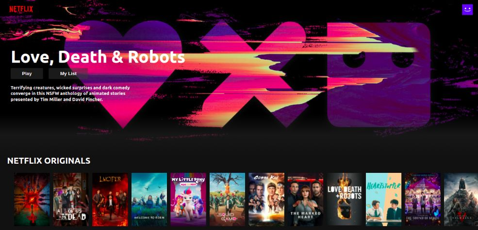

# Netflix 2.0

### [Site link](https://netflix-clone-ae764.firebaseapp.com/)

<kbd>
  
</kbd>

### 🛠 The tech stack is:

- [React](https://reactjs.org/)
- [React-router-dom](https://reactrouter.com/docs/en/v6/getting-started/overview)
- [Redux-toolkit](https://redux-toolkit.js.org/)
- [React-loading-skeleton](https://github.com/dvtng/react-loading-skeleton)
- [React-lazy-load-image-component](https://github.com/Aljullu/react-lazy-load-image-component)
- [Firebase authentication](https://firebase.google.com/)
- [HTML5](https://en.wikipedia.org/wiki/HTML5)
- [CSS3](https://en.wikipedia.org/wiki/Cascading_Style_Sheets)
- [Flexbox](https://en.wikipedia.org/wiki/CSS_Flexible_Box_Layout)
- [BEM methodology](https://en.bem.info/methodology/)
- [Create-react-app](https://create-react-app.dev/docs/getting-started/)
- [PropTypes](https://ru.reactjs.org/docs/typechecking-with-proptypes.html)
- [axios](https://github.com/axios/axios)
- [eslint](https://eslint.org/)
- [stylelint](https://stylelint.io/)
- [prettier](https://prettier.io/)
